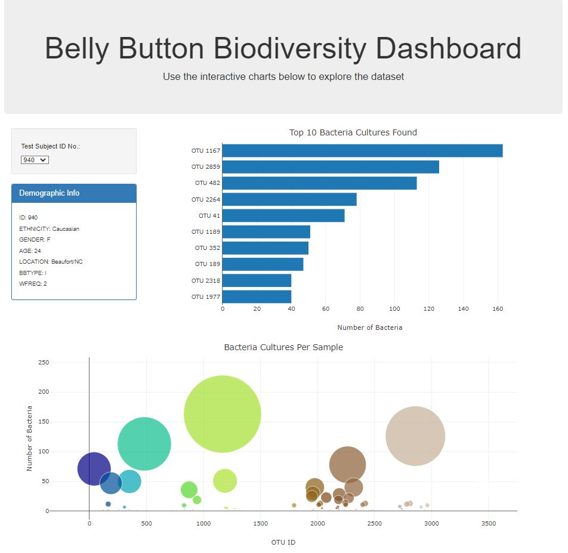

# belly-button-challenge
This project requires us to build an interactive dashboard to explore the Belly Button Biodiversity dataset, which catalogs the microbes that colonize human navels. To reveals that a small handful of microbial species (also called operational taxonomic units, or OTUs, in the study) were present in more than 70% of people.

** Belly Button Deployment Website: **
https://seashell-coder.github.io/belly-button-challenge/ 

<h2>Index</h2> 
1. Content of the repository 
2. Instructions for the Challenge 
3. References 

Content of the repository
-----------------------------------------------------------
- index.html    --> This is the HTML used for this project, with some changes to deploy as a static wesbite.
- samples.json  --> This is the database JSON file with the data used for this project
- js directory:
  -  app.js --> This is the JSON file that makes the charts(bar, bubble) to be interactive with information from the sample.json dataset.
<h2> Instruction for this challenge is divided into below steps: </h2> 

<h3>Step1: Use the D3 library to read in samples.json from the URL https://static.bc-edx.com/data/dl-1-2/m14/lms/starter/samples.json.</h3>  
<h3>Step2: Create a horizontal bar chart with a dropdown menu to display the top 10 OTUs found in that individual.</h3>

    - Use sample_values as the values for the bar chart.

    - Use otu_ids as the labels for the bar chart.

    - Use otu_labels as the hovertext for the chart.
<h3>Step3: Create a bubble chart that displays each sample.</h3> 

    - Use otu_ids for the x values.

    - Use sample_values for the y values.

    - Use sample_values for the marker size.

    - Use otu_ids for the marker colors.

    - Use otu_labels for the text values.
<h3>Step4: Display the sample's metadata, i.e., an individual's demographic information.</h3> 

    - Loop through each key-value pair from the metadata JSON object and create a text string.

    - Append an html tag with that text to the #sample-metadata panel.

<h3>Step5: Update all the plots when a new sample is selected. Additionally, you are welcome to create any layout that you would like for your dashboard. An example dashboard is shown as follows:</h3> 

  

<h3>References: </h3>

Dataset: Hulcr, J. et al. (2012) A Jungle in There: Bacteria in Belly Buttons are Highly Diverse, but Predictable. Retrieved from: http://robdunnlab.com/projects/belly-button-biodiversity/results-and-data/Links to an external site. 

Most of the challenge tasks were covered during our class activity works, just for the charts I used below documentation links:

- Bar and Bubble Charts:
  - https://plotly.com/javascript/bar-charts/
  - https://plotly.com/javascript/bubble-charts/ 

